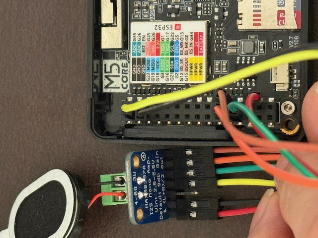

# M5Stack Money Eyes Robot 👀💰


A charming robot face animation project for M5Stack Basic featuring random eye movements, natural blinking, and sound effects when eyes transform into dollar signs! 🤖

**Perfect for beginners** - Detailed explanations included for those new to embedded programming!

[日本語版はこちら / Japanese Version](README_JP.md)

## 🎯 What This Robot Does

- 👀 **Realistic Eye Movement**: Eyes randomly look around like they're alive
- 😊 **Natural Blinking**: Blinks every 2-5 seconds, just like real eyes
- 💰 **Money Mode**: Eyes transform into "$" symbols every 4-8 seconds
- 🔊 **Sound Effects**: Plays cash register sound when entering money mode
- 📱 **Firmware Display**: Shows version info at startup (never forget which code you uploaded!)

## 🚀 Why I Built This

I was playing around with M5Stack and thought, "Wouldn't it be cool to make some fun animations?" 

Initially, I tried using the built-in speaker, but the **noise was terrible!** 😅 Crackling, popping, and distortion everywhere.

That's when I decided to use an external I2S amplifier (MAX98357A) to achieve crystal-clear audio quality!

## 🛠️ Required Components

### Shopping List
- **M5Stack Basic v2.7** (Main board)
- **MAX98357A I2S Amplifier Module** (~$3)
- **Speaker** (4Ω, 3W recommended) (~$2)
- **Jumper wires** (For connections) (~$1)
- **microSD card** (For audio storage) (~$3)

### Total Budget: ~$10 💰
*Prices exclude the M5Stack itself*

## 🔌 Super Simple Wiring

Only 6 connections needed! Here's the actual wiring setup:


*Actual connection photo showing the 6-wire setup*

| Wire Color | MAX98357A Pin | M5Stack Basic Pin | Pin Location | Purpose |
|------------|---------------|-------------------|--------------|---------|
| 🔴 Red     | VIN           | 5V                | Right column, 14th from top | Power Supply |
| ⚫ Black   | GND           | GND               | Left column, 3rd from top | Ground |
| 🟡 Yellow  | GAIN          | GND               | Left column, 2nd from top | Gain Control (0dB) |
| 🟢 Green   | DIN           | G15 (IISOUT)      | Left column, 12th from top | Audio Data |
| 🟠 Orange  | BCLK          | G12 (IISK)        | Left column, 11th from top | Bit Clock |
| 🟤 Brown   | LRC           | G13 (II_WS)       | Right column, 11th from top | Left/Right Clock |

**Important Notes:**
- 🔴 **VIN to 5V**: Provides sufficient power for the amplifier
- 🟡 **GAIN to GND**: Sets gain to 9dB (moderate volume)
- ⚫ **SD (Shutdown)**: Leave unconnected (defaults to enabled)
- 📍 **Pin counting**: Count from the top of each column as shown in the photo

**Detailed Pin Mapping:**
```
M5Stack Basic Pinout Reference:
Left Column:          Right Column:
1. G23               1. G1
2. GND  ← GAIN       2. G3  
3. GND  ← GND        3. G16
...                  ...
11. G12 ← BCLK       11. G13 ← LRC
12. G15 ← DIN        12. G2
13. G34              13. G5
14. G35              14. 5V  ← VIN
```

## 💻 Code Explanation (Beginner-Friendly!)

### 🏗️ Basic Structure
Let's start with the foundation:

```cpp
// Firmware info (Important! Never forget which code you uploaded)
#define FW_NAME "Money-Eyes Robot"      // Project name
#define FW_VERSION "v1.2"               // Version number
#define FW_BUILD "I2S Audio Edition"    // Build type

// Eye positions on 320x240 screen
const int LEFT_X = 100;     // Left eye X coordinate (100px from left)
const int RIGHT_X = 220;    // Right eye X coordinate (220px from left)
const int CENTER_Y = 120;   // Eye Y coordinate (120px from top)
const int R_WHITE = 55;     // White part radius
const int R_BLACK = 20;     // Black pupil radius
```

**Why `const`?** → These values never change, so we protect them from accidental modification.

### 🎵 I2S Audio System Magic
Initially, the built-in speaker had these problems:
- ❌ Terrible noise (hissing sounds)
- ❌ Audio distortion (music sounded crushed)
- ❌ Crackling/popping noises (digital interference)

**The Solution: I2S (Inter-IC Sound)**
```cpp
// I2S configuration (Digital audio communication settings)
#define I2S_SAMPLE_RATE 44100  // Sample 44,100 times per second (CD quality)
#define I2S_SAMPLE_BITS 16     // 16-bit audio data
#define I2S_CHANNELS    2      // Stereo (left + right channels)

// Pin assignment (Connecting M5Stack to MAX98357A)
#define I2S_BCK_IO  (12)  // Bit clock (audio timing signal)
#define I2S_WS_IO   (13)  // Word select (left/right channel switch)
#define I2S_DO_IO   (15)  // Data output (actual audio data)
```

**Core Noise Reduction Strategy:**
```cpp
// Stop other functions that cause electrical noise
WiFi.mode(WIFI_OFF);  // WiFi radio waves cause interference
btStop();             // Bluetooth also causes noise

// Disable M5Stack's built-in speaker pins (prevent conflicts)
pinMode(25, INPUT_PULLDOWN);  // Original LRC pin → safe state
pinMode(26, INPUT_PULLDOWN);  // Original BCLK pin → safe state
```

### 🔧 DMA Buffer: The Secret to Smooth Audio

DMA (Direct Memory Access) lets audio data flow directly from memory to the speaker **without using the CPU**.

```cpp
i2s_config_t i2s_config = {
    // ... other settings ...
    .dma_buf_count = 8,      // Number of DMA buffers (Important!)
    .dma_buf_len = 1024,     // Size of each buffer (samples)
};
```

**Why are DMA buffers crucial?**
- 🎵 **Prevents audio dropouts**: Music keeps playing even when CPU is busy
- 🔄 **Buffer rotation**: While one plays, another loads new data
- 📊 **Right sizing**: Too small = dropouts, too large = delay

**Buffer calculation:**
```
Total buffer memory = dma_buf_count × dma_buf_len × 4 bytes
Example: 8 × 1024 × 4 = 32KB

For 44.1kHz stereo:
1 second of audio = 44,100 × 2ch × 2 bytes = 176.4KB
32KB = about 0.18 seconds of buffering
```

**How buffer rotation works:**
```
[Buffer 1: Playing] → Speaker
[Buffer 2: Loading] ← SD card data
[Buffer 3: Empty]
...
[Buffer 8: Empty]

As playback continues...
[Buffer 2: Playing] → Speaker  
[Buffer 3: Loading] ← SD card data
[Buffer 1: Empty]   ← Ready for next data
```

**Careful buffer initialization:**
```cpp
// Completely clear DMA buffers
i2s_zero_dma_buffer(I2S_NUM);
delay(100);

// Fill with silence to prevent noise
int16_t silence[2048] = {0};
for (int i = 0; i < 15; i++) {
    i2s_write(I2S_NUM, silence, sizeof(silence), &bytesWritten, 1000);
    delay(5);  // Wait between writes (Important!)
}
```

**Why such careful initialization?**
- Power-on buffers contain random garbage data
- This garbage causes "pop" sounds
- Overwriting with silence ensures clean startup

### 🎭 Animation Control Secrets

**Making eye movement look natural:**
```cpp
// Current position and target position variables
int curX = 0, curY = 0;    // Current pupil position
int tgtX = 0, tgtY = 0;    // Target pupil position

// Move 1 pixel at a time (Critical for smoothness!)
if (curX < tgtX) curX++;        // If left of target, move right 1px
else if (curX > tgtX) curX--;   // If right of target, move left 1px

if (curY < tgtY) curY++;        // If above target, move down 1px  
else if (curY > tgtY) curY--;   // If below target, move up 1px
```

**Why 1 pixel at a time?**
- Jumping directly to target looks robotic and unnatural
- Human eye movement is smooth and continuous
- Small incremental movement creates "living" feeling

**How target positions are chosen:**
```cpp
// When current position reaches target, set new random target
if (curX == tgtX && curY == tgtY) {
    tgtX = random(-30, 31);   // Random horizontal ±30px range
    tgtY = random(-15, 16);   // Random vertical ±15px range
}
```

### 🎨 Graphics System Tricks

**Why use sprites (temporary drawing surfaces)?**
```cpp
TFT_eSprite spr(&M5.Lcd);        // Create off-screen canvas
spr.createSprite(320, 240);      // Same size as main screen

// Draw complete frame off-screen
spr.fillScreen(TFT_BLACK);                                    // Black background
spr.fillCircle(LEFT_X, CENTER_Y, R_WHITE, TFT_WHITE);        // Left white eye
spr.fillCircle(RIGHT_X, CENTER_Y, R_WHITE, TFT_WHITE);       // Right white eye
spr.fillCircle(LEFT_X + curX, CENTER_Y + curY, R_BLACK, TFT_BLACK);  // Left pupil

// Display entire frame at once
spr.pushSprite(0, 0);
```

**Benefits:**
- No flickering during drawing
- Smooth animation
- No interference from partial updates

### 💰 Money Mode Toggle Logic

```cpp
bool moneyMode = false;          // Currently in money mode?
bool prevMoney = false;          // Was in money mode last frame? (for sound control)

// Random toggle every 4-8 seconds
if (now >= nextMoney) {
    moneyMode = !moneyMode;                    // Flip true↔false
    nextMoney = now + random(4000, 8000);     // Set next toggle time
}

// Play sound only when entering money mode
if (moneyMode && !prevMoney && !soundPlayed) {
    playWAVFile();  // Play sound effect
}
```

**Why is `prevMoney` needed?**
- Without it, sound would play every frame (disaster! 😅)
- We only want sound when "entering" money mode
- Comparing current vs previous state detects the transition

### ⏱️ Timing Control System

```cpp
unsigned long nextBlink = 0;     // Next blink scheduled time
unsigned long nextMoney = 0;     // Next money mode toggle time

// Blink detection
if (millis() >= nextBlink) {
    // Execute blink
    drawEyes(curX, curY, true);   // Close eyes
    delay(120);                   // Wait 120 milliseconds
    drawEyes(curX, curY, false);  // Open eyes
    
    // Schedule next blink (random 2-5 seconds later)
    nextBlink = millis() + random(2000, 5000);
}
```

**What is `millis()`?** → Returns milliseconds since power-on. Perfect for timing!

## 📁 File Structure

```
project/
├── money_eyes_robot.ino    # Main program
└── cash_44_stereo.wav      # Sound effect (place on SD card root)
```

## 📁 Project Structure

```
M5Stack_i2s_output/
├── src/main.cpp                    # PlatformIO source (English)
├── arduino_ide/                    # Arduino IDE versions
│   ├── money_eyes_robot_jp/        # Japanese version
│   │   └── money_eyes_robot_jp.ino
│   └── money_eyes_robot_en/        # English version
│       └── money_eyes_robot_en.ino
├── audio/                          # Audio files
│   ├── README.md                   # Audio documentation
│   └── cash_44_stereo.wav         # Sound effect (OtoLogic)
├── docs/                           # Documentation
│   ├── wiring_photo.jpg           # Wiring diagram
│   └── setup_guide.md             # Setup instructions
├── README.md                       # English documentation
├── README_JP.md                   # Japanese documentation
├── .gitignore                     # Git ignore rules
└── LICENSE                        # MIT License
```

## 🚀 Step-by-Step Setup

### 1. Arduino IDE Configuration
```
Board Manager: M5Stack-Core-ESP32
Library: M5Stack by M5Stack (install via Library Manager)
```

### 2. Audio File Preparation
- Download or create `cash_44_stereo.wav`
- **Format requirements**: 44.1kHz, 16-bit, Stereo
- Place file in SD card root directory (not in any folder!)

### 3. Hardware Assembly
Follow the wiring diagram above:
- 🔴 **Red wire**: VIN → 5V (sufficient power for amplifier)
- ⚫ **Black wire**: GND → GND (ground connection)
- 🟡 **Yellow wire**: GAIN → GND (sets 9dB gain level)
- 🟢 **Green wire**: DIN → G15 (audio data)
- 🟠 **Orange wire**: BCLK → G12 (bit clock)
- 🟤 **Brown wire**: LRC → G13 (left/right clock)

**Wiring Tips:**
- Use short jumper wires to minimize noise
- Double-check pin positions using the photo reference
- Ensure solid connections for stable audio

### 4. Upload and Test
- Compile in Arduino IDE
- Upload to M5Stack
- Insert SD card with audio file
- Power on and enjoy!

## 😅 Problems I Encountered (& Solutions!)

### 1. Weird Audio During Money Mode
**Symptoms**: Sound distortion, crackling during $ display

**Root cause**: Animation drawing was interfering with audio playback

**Solution**: 
- Changed to simple blocking playback method
- Increased DMA buffer size (8 buffers, 1024 samples each)
- Added duplicate playback prevention flag

### 2. "Pop" Sound After Playback
**Symptoms**: Sharp "pop" noise when audio finishes

**Solution**: Gradual fade-out processing
```cpp
// 4-stage gentle ending process
// 1. Short silence to clear buffers
// 2. Gradual DMA buffer clearing  
// 3. Additional silence for complete muting
// 4. Final DMA clear
```

### 3. Forgetting Which Firmware Was Uploaded
**Symptoms**: Constantly forgetting which program was running 😅

**Solution**: Show firmware info for 5 seconds at startup
```cpp
void showFirmwareInfo() {
  M5.Lcd.printf("Firmware: %s %s", FW_NAME, FW_VERSION);
  M5.Lcd.printf("Build: %s", FW_BUILD);
  // ... detailed info display
}
```

## 🎨 Customization Ideas

### Different Eye Expressions
```cpp
// Angry eyes
spr.fillTriangle(LEFT_X-20, CENTER_Y-20, LEFT_X+20, CENTER_Y-20, LEFT_X, CENTER_Y-5, TFT_RED);

// Heart eyes
spr.fillCircle(LEFT_X, CENTER_Y, 15, TFT_RED);
spr.fillTriangle(LEFT_X-10, CENTER_Y-5, LEFT_X+10, CENTER_Y-5, LEFT_X, CENTER_Y+10, TFT_RED);
```

### Multiple Sound Effects
```cpp
const char* soundFiles[] = {
  "/cash_register.wav",
  "/coin_drop.wav", 
  "/cha_ching.wav"
};
```

### Movement Adjustments
```cpp
// More frequent blinking
nextBlink = now + random(1000, 3000);  // 1-3 seconds instead of 2-5

// Wider eye movement
tgtX = random(-50, 51);  // ±50px instead of ±30px
```

## 🔧 Technical Specifications

### Performance Metrics
- **Memory Usage**: ~85KB (including 75KB for sprites)
- **CPU Usage**: <30% during normal operation
- **Frame Rate**: ~100 FPS for smooth animation
- **Audio Latency**: ~180ms (due to buffer size)

### Audio Specifications
- **Sample Rate**: 44.1kHz (CD quality)
- **Bit Depth**: 16-bit
- **Channels**: Stereo (2 channels)
- **Output**: I2S Digital Audio
- **Amplifier**: MAX98357A Class D

## 🔧 Troubleshooting Guide

### No Audio Output
**Check these:**
1. MAX98357A wiring (especially power and ground connections)
2. Wire colors match the table above
3. Pin positions: count from top as shown in photo
4. 5V power connection (not 3.3V)
5. Audio file exists on SD card root
6. File format (must be 44.1kHz/16-bit/Stereo WAV)
7. Serial monitor for error messages

### Poor Audio Quality
**Possible causes:**
- Unstable 5V power supply (try external power)
- Long jumper wires (keep connections short)
- Wrong speaker impedance (use 4Ω speaker)
- GAIN setting (yellow wire to GND sets 9dB)
- SD card read speed too slow

### Unstable Operation
**Check these:**
- M5Stack power capacity (USB may not provide enough current)
- SD card format (use FAT32)
- Code upload success (watch for upload errors)

## 📈 Future Development Plans

- **v1.3: Electronic Pop Mode** 🎵
  - Expression changes synchronized with music
  - Beat detection for dynamic facial animations
  - Multiple expression patterns for different music genres
  - Real-time audio analysis for responsive reactions

- **v1.4: Eye Tracking Mode** 👁️‍🗨️
  - AI-powered eye tracking system
  - Raspberry Pi integration for computer vision
  - Object detection and following capabilities
  - Camera-based face recognition and interaction

## 🎓 Educational Value

This project is perfect for learning:
- **Embedded Programming**: Real-time systems, timing control
- **Digital Audio**: I2S protocol, DMA buffers, sample rates
- **Graphics Programming**: Sprite rendering, animation techniques
- **Hardware Interfacing**: GPIO control, external amplifiers
- **State Machines**: Mode switching, event handling

## 🤝 Contributing

Found a bug? Have an improvement idea? Contributions welcome!

1. Fork this repository
2. Create feature branch (`git checkout -b feature/amazing-feature`)
3. Commit changes (`git commit -m 'Add amazing feature'`)
4. Push to branch (`git push origin feature/amazing-feature`)
5. Create Pull Request

## 📄 License

This project is licensed under the MIT License - see the [LICENSE](LICENSE) file for details.

## 🙏 Acknowledgments

- **M5Stack Community** for excellent hardware and documentation
- **Arduino Community** for the robust development ecosystem
- **ESP32 Documentation** for comprehensive I2S guides
- **MAX98357A Datasheet** authors for clear technical specifications
- **Audio Effects**: [OtoLogic](https://otologic.jp/) - Free for commercial and non-commercial use ([License](https://otologic.jp/free/license.html))

## 📞 Support & Community

Need help? Found a bug? Want to share your build?

- 🐛 **Report Issues**: [GitHub Issues](https://github.com/yokoyan-robotics/m5stack-money-eyes-robot/issues)
- 💬 **Discussions**: [GitHub Discussions](https://github.com/yokoyan-robotics/m5stack-money-eyes-robot/discussions)
- 📸 **Share Builds**: Tag `#MoneyEyesRobot` on social media!

## 🌟 Show Your Support

If this project helped you:
- ⭐ **Star this repository**
- 🐛 **Report bugs** you find
- 💡 **Suggest features** you'd like
- 📖 **Improve documentation**
- 🔀 **Contribute code**
- 📸 **Share your build** on social media

---

**Made with ❤️ for makers and learners everywhere!**

*Happy building! 🚀*