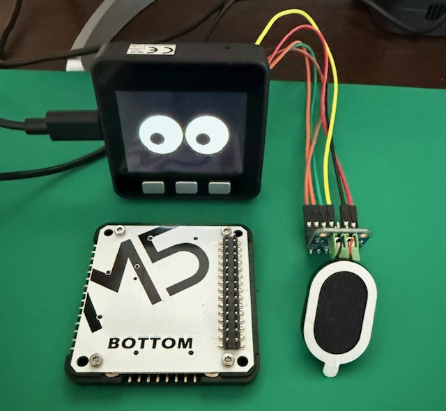
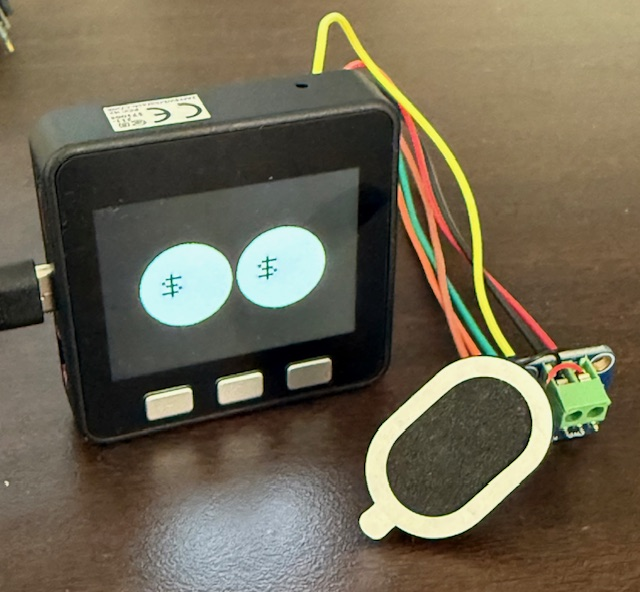
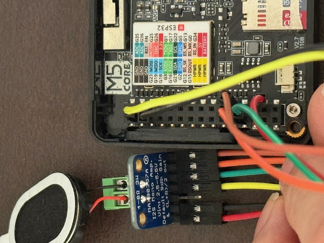

# M5Stack Money Eyes Robot 👀💰


M5Stack Basicを使用した可愛いロボット顔アニメーションプロジェクト。ランダムな視線移動、自然なまばたき、そして目がドル記号に変化する時の効果音付き！🤖

**初心者にも優しい** - 組み込みプログラミングが初めての方にも分かりやすい詳細解説付き！

[English Version](README.md)

## 🎯 このロボットができること

|  |  |
|:-------------------:|:-------------------:|
| *完成イメージ(今回はM5 BOTTOM不要)*      | *チャリーン音が鳴った瞬間*      |

- 👀 **リアルな視線移動**: 生きているように目がランダムに動き回る
- 😊 **自然なまばたき**: 2〜5秒間隔で実際の目のようにまばたき
- 💰 **マネーモード**: 4〜8秒間隔で目が「$」マークに変化
- 🔊 **効果音**: マネーモードになった瞬間にレジ音が再生
- 📱 **ファームウェア表示**: 起動時にバージョン情報表示（どのコードを書き込んだか忘れない！）

## 🚀 作ったきっかけ

M5Stackで遊んでいて、「何か面白いアニメーションできないかな？」と思ったのがきっかけです。

最初は内蔵スピーカーを使おうとしたんですが、**ノイズがひどくて！** 😅 クラクラ音、ポップ音、歪みまくりでした。

そこで外部I2Sアンプ（MAX98357A）を使って、クリスタルクリアな音質を実現しました！

## 🛠️ 必要な部品

### 買い物リスト
- **M5Stack Basic v2.7** (メイン基板)
- **MAX98357A I2Sアンプモジュール** (~300円)
- **スピーカー** (4Ω、3W推奨) (~200円)
- **ジャンパーワイヤー** (配線用) (~100円)
- **microSDカード** (音声保存用) (~300円)

### 総予算: 約1,000円 💰
*M5Stack本体は除く*

## 🔌 超シンプル配線

たった6本の配線だけ！実際の配線セットアップです：



*6本の配線による実際の接続写真*

| 線の色 | MAX98357Aピン | M5Stack Basic ピン | ピン位置 | 用途 |
|--------|---------------|-------------------|----------|------|
| 🔴 赤  | VIN           | 5V                | 右列上から14番目 | 電源供給 |
| ⚫ 黒  | GND           | GND               | 左列上から3番目 | グランド |
| 🟡 黄  | GAIN          | GND               | 左列上から2番目 | ゲイン制御 (9dB) |
| 🟢 緑  | DIN           | G15 (IISOUT)      | 左列上から12番目 | 音声データ |
| 🟠 橙  | BCLK          | G12 (IISK)        | 左列上から11番目 | ビットクロック |
| 🟤 茶  | LRC           | G13 (II_WS)       | 右列上から11番目 | 左右クロック |

**重要なポイント:**
- 🔴 **VIN → 5V**: アンプに十分な電力を供給
- 🟡 **GAIN → GND**: ゲインを9dBに設定（適度な音量）
- ⚫ **SD (Shutdown)**: 未接続のまま（デフォルトで有効）
- 📍 **ピン数え方**: 写真のように各列の上から数える

**詳細ピンマッピング:**
```
M5Stack Basic ピン配置参考:
左列:                右列:
1. G23               1. G1
2. GND  ← GAIN       2. G3  
3. GND  ← GND        3. G16
...                  ...
11. G12 ← BCLK       11. G13 ← LRC
12. G15 ← DIN        12. G2
13. G34              13. G5
14. G35              14. 5V  ← VIN
```

## 💻 コード解説（初心者向け！）

### 🏗️ 基本構造
まずは土台から説明します：

```cpp
// ファームウェア情報（重要！どのコードを書き込んだか忘れない）
#define FW_NAME "Money-Eyes Robot"      // プロジェクト名
#define FW_VERSION "v1.2"               // バージョン番号
#define FW_BUILD "I2S Audio Edition"    // ビルド種別

// 320x240画面での目の位置
const int LEFT_X = 100;     // 左目のX座標（左端から100ピクセル）
const int RIGHT_X = 220;    // 右目のX座標（左端から220ピクセル）
const int CENTER_Y = 120;   // 目のY座標（上端から120ピクセル）
const int R_WHITE = 55;     // 白目の半径
const int R_BLACK = 20;     // 黒目の半径
```

**なぜ`const`？** → 一度決めたら変更しない値なので、間違って書き換えないよう保護します。

### 🎵 I2S音声システムの魔法
最初、内蔵スピーカーではこんな問題がありました：
- ❌ ひどいノイズ（サーッという音）
- ❌ 音の歪み（音楽が潰れる）
- ❌ クラクラ・ポップ音（デジタル干渉）

**解決策: I2S (Inter-IC Sound)**
```cpp
// I2S設定（デジタル音声通信設定）
#define I2S_SAMPLE_RATE 44100  // 1秒間に44,100回サンプリング（CD品質）
#define I2S_SAMPLE_BITS 16     // 16ビット音声データ
#define I2S_CHANNELS    2      // ステレオ（左+右チャンネル）

// ピン割り当て（M5StackとMAX98357Aを接続）
#define I2S_BCK_IO  (12)  // ビットクロック（音声タイミング信号）
#define I2S_WS_IO   (13)  // ワードセレクト（左右チャンネル切り替え）
#define I2S_DO_IO   (15)  // データ出力（実際の音声データ）
```

**核心的なノイズ対策:**
```cpp
// 電気的ノイズの原因となる他機能を停止
WiFi.mode(WIFI_OFF);  // WiFi電波が干渉するので停止
btStop();             // Bluetoothも同様にノイズ原因

// M5Stack内蔵スピーカーピンを無効化（競合防止）
pinMode(25, INPUT_PULLDOWN);  // 元のLRCピン → 安全な状態
pinMode(26, INPUT_PULLDOWN);  // 元のBCLKピン → 安全な状態
```

### 🔧 DMAバッファ: スムーズ音声の秘密

DMA（Direct Memory Access）は、CPUを使わずに音声データをメモリから直接スピーカーに流す仕組みです。

```cpp
i2s_config_t i2s_config = {
    // ... 他の設定 ...
    .dma_buf_count = 8,      // DMAバッファの個数（重要！）
    .dma_buf_len = 1024,     // 各バッファのサイズ（サンプル数）
};
```

**なぜDMAバッファが重要？**
- 🎵 **音の途切れ防止**: CPUが忙しくても音楽が止まらない
- 🔄 **バッファローテーション**: 1つが再生中にもう1つが新しいデータをロード
- 📊 **適切なサイズ**: 小さすぎると途切れる、大きすぎると遅延

**バッファ計算:**
```
総バッファメモリ = dma_buf_count × dma_buf_len × 4バイト
例: 8 × 1024 × 4 = 32KB

44.1kHzステレオの場合:
1秒の音声 = 44,100 × 2ch × 2バイト = 176.4KB
32KB = 約0.18秒分のバッファリング
```

**バッファローテーションの仕組み:**
```
[バッファ1: 再生中] → スピーカー
[バッファ2: ロード中] ← SDカードデータ
[バッファ3: 空き]
...
[バッファ8: 空き]

再生が進むと...
[バッファ2: 再生中] → スピーカー  
[バッファ3: ロード中] ← SDカードデータ
[バッファ1: 空き]   ← 次のデータ待ち
```

**丁寧なバッファ初期化:**
```cpp
// DMAバッファを完全にクリア
i2s_zero_dma_buffer(I2S_NUM);
delay(100);

// 無音データで埋めてノイズ防止
int16_t silence[2048] = {0};
for (int i = 0; i < 15; i++) {
    i2s_write(I2S_NUM, silence, sizeof(silence), &bytesWritten, 1000);
    delay(5);  // 書き込み間の待機（重要！）
}
```

**なぜこんなに丁寧な初期化？**
- 電源ON直後のバッファにはランダムなゴミデータが入っている
- このゴミが「ポップ」音の原因
- 無音データで上書きしてクリーンな起動を保証

### 🎭 アニメーション制御の秘密

**目の動きを自然に見せるテクニック:**
```cpp
// 現在位置と目標位置の変数
int curX = 0, curY = 0;    // 現在の瞳の位置
int tgtX = 0, tgtY = 0;    // 目標の瞳の位置

// 1ピクセルずつ移動（滑らかさの鍵！）
if (curX < tgtX) curX++;        // 目標より左なら右に1ピクセル
else if (curX > tgtX) curX--;   // 目標より右なら左に1ピクセル

if (curY < tgtY) curY++;        // 目標より上なら下に1ピクセル  
else if (curY > tgtY) curY--;   // 目標より下なら上に1ピクセル
```

**なぜ1ピクセルずつ？**
- いきなり目標位置にジャンプするとロボット的で不自然
- 人間の目の動きは滑らかで連続的
- 小刻みな動きが「生きている」感覚を作る

**目標位置の決め方:**
```cpp
// 現在位置が目標に到達したら新しいランダム目標を設定
if (curX == tgtX && curY == tgtY) {
    tgtX = random(-30, 31);   // 水平方向±30ピクセルの範囲
    tgtY = random(-15, 16);   // 垂直方向±15ピクセルの範囲
}
```

### 🎨 グラフィックシステムのトリック

**なぜスプライト（一時描画面）を使う？**
```cpp
TFT_eSprite spr(&M5.Lcd);        // オフスクリーンキャンバスを作成
spr.createSprite(320, 240);      // メイン画面と同じサイズ

// オフスクリーンで完全なフレームを描画
spr.fillScreen(TFT_BLACK);                                    // 黒背景
spr.fillCircle(LEFT_X, CENTER_Y, R_WHITE, TFT_WHITE);        // 左の白目
spr.fillCircle(RIGHT_X, CENTER_Y, R_WHITE, TFT_WHITE);       // 右の白目
spr.fillCircle(LEFT_X + curX, CENTER_Y + curY, R_BLACK, TFT_BLACK);  // 左の瞳

// 完成したフレームを一度に表示
spr.pushSprite(0, 0);
```

**メリット:**
- 描画中のちらつきなし
- 滑らかなアニメーション
- 部分更新による干渉なし

### 💰 マネーモード切り替えロジック

```cpp
bool moneyMode = false;          // 現在マネーモード中？
bool prevMoney = false;          // 前フレームでマネーモードだった？（音声制御用）

// 4〜8秒間隔でランダム切り替え
if (now >= nextMoney) {
    moneyMode = !moneyMode;                    // true↔falseを切り替え
    nextMoney = now + random(4000, 8000);     // 次の切り替え時刻を設定
}

// マネーモード突入時のみ音声再生
if (moneyMode && !prevMoney && !soundPlayed) {
    playWAVFile();  // 効果音再生
}
```

**なぜ`prevMoney`が必要？**
- これがないと毎フレーム音が鳴って大変なことに😅
- 「マネーモードに入った瞬間」だけを検出したい
- 現在と前回の状態を比較して変化を検出

### ⏱️ タイミング制御システム

```cpp
unsigned long nextBlink = 0;     // 次のまばたき予定時刻
unsigned long nextMoney = 0;     // 次のマネーモード切り替え予定時刻

// まばたき判定
if (millis() >= nextBlink) {
    // まばたき実行
    drawEyes(curX, curY, true);   // 目を閉じる
    delay(120);                   // 120ミリ秒待機
    drawEyes(curX, curY, false);  // 目を開く
    
    // 次のまばたき時刻をスケジュール（ランダム2〜5秒後）
    nextBlink = millis() + random(2000, 5000);
}
```

**`millis()`って何？** → 電源ONからの経過時間をミリ秒で返す関数。タイミング制御に最適！

## 📁 ファイル構成

```
project/
├── money_eyes_robot.ino    # メインプログラム
└── cash_44_stereo.wav      # 効果音（SDカードルートに配置）
```

## 📁 プロジェクト構成

```
M5Stack_i2s_output/
├── src/main.cpp                    # PlatformIO用（英語版）
├── arduino_ide/                    # Arduino IDE用
│   ├── money_eyes_robot_jp/        # 日本語版
│   │   └── money_eyes_robot_jp.ino
│   └── money_eyes_robot_en/        # 英語版
│       └── money_eyes_robot_en.ino
├── audio/                          # 音声ファイル
│   ├── README.md                   # 音声ファイル説明
│   └── cash_44_stereo.wav         # 効果音（OtoLogic提供）
├── docs/                           # ドキュメント
│   ├── wiring_photo.jpg           # 配線図
│   └── setup_guide.md             # セットアップガイド
├── README.md                       # 英語版ドキュメント
├── README_JP.md                   # 日本語版ドキュメント
├── .gitignore                     # Git除外設定
└── LICENSE                        # MITライセンス
```

## 🚀 ステップバイステップ セットアップ

### 1. Arduino IDE設定
```
ボードマネージャー: M5Stack-Core-ESP32
ライブラリ: M5Stack by M5Stack（ライブラリマネージャーでインストール）
```

### 2. 音声ファイル準備
- `cash_44_stereo.wav`をダウンロードまたは作成
- **フォーマット要件**: 44.1kHz、16ビット、ステレオ
- SDカードのルートディレクトリに配置（フォルダ内ではなく！）

### 3. ハードウェア組み立て
上記の配線図に従って：
- 🔴 **赤線**: VIN → 5V（アンプに十分な電力供給）
- ⚫ **黒線**: GND → GND（グランド接続）
- 🟡 **黄線**: GAIN → GND（9dBゲインレベル設定）
- 🟢 **緑線**: DIN → G15（音声データ）
- 🟠 **橙線**: BCLK → G12（ビットクロック）
- 🟤 **茶線**: LRC → G13（左右クロック）

**配線のコツ:**
- ノイズを最小化するため短いジャンパーワイヤーを使用
- 写真を参考にピン位置を再確認
- 安定した音声のため確実な接続を確保

### 4. アップロード・テスト
- Arduino IDEでコンパイル
- M5Stackにアップロード
- 音声ファイル入りSDカードを挿入
- 電源ONして楽しもう！

## 😅 遭遇した問題（＆解決法！）

### 1. マネーモード中の音声異常
**症状**: $表示中に音の歪み、クラクラ音

**根本原因**: アニメーション描画が音声再生に干渉

**解決法**: 
- シンプルなブロッキング再生方式に変更
- DMAバッファサイズを増加（8バッファ、各1024サンプル）
- 重複再生防止フラグを追加

### 2. 再生終了後の「ポップ」音
**症状**: 音声終了時の鋭い「ポップ」ノイズ

**解決法**: 段階的フェードアウト処理
```cpp
// 4段階の丁寧な終了処理
// 1. 短い無音でバッファクリア
// 2. 段階的DMAバッファクリア  
// 3. 追加無音で完全消音
// 4. 最終DMAクリア
```

### 3. どのファームウェアを書き込んだか忘れる
**症状**: 毎回どのプログラムが動いているか分からない😅

**解決法**: 起動時に5秒間ファームウェア情報を表示
```cpp
void showFirmwareInfo() {
  M5.Lcd.printf("Firmware: %s %s", FW_NAME, FW_VERSION);
  M5.Lcd.printf("Build: %s", FW_BUILD);
  // ... 詳細情報表示
}
```

## 🎨 カスタマイズアイデア

### 異なる目の表情
```cpp
// 怒った目
spr.fillTriangle(LEFT_X-20, CENTER_Y-20, LEFT_X+20, CENTER_Y-20, LEFT_X, CENTER_Y-5, TFT_RED);

// ハート目
spr.fillCircle(LEFT_X, CENTER_Y, 15, TFT_RED);
spr.fillTriangle(LEFT_X-10, CENTER_Y-5, LEFT_X+10, CENTER_Y-5, LEFT_X, CENTER_Y+10, TFT_RED);
```

### 複数の効果音
```cpp
const char* soundFiles[] = {
  "/cash_register.wav",
  "/coin_drop.wav", 
  "/cha_ching.wav"
};
```

### 動きの調整
```cpp
// より頻繁なまばたき
nextBlink = now + random(1000, 3000);  // 1〜3秒間隔に短縮

// より大きな目の動き
tgtX = random(-50, 51);  // ±50ピクセルに拡大
```

## 🔧 技術仕様

### パフォーマンス指標
- **メモリ使用量**: 約85KB（スプライト用75KB含む）
- **CPU使用率**: 通常動作時30%未満
- **フレームレート**: 滑らかなアニメーション用に約100 FPS
- **音声遅延**: 約180ms（バッファサイズによる）

### 音声仕様
- **サンプルレート**: 44.1kHz（CD品質）
- **ビット深度**: 16ビット
- **チャンネル**: ステレオ（2チャンネル）
- **出力**: I2Sデジタル音声
- **アンプ**: MAX98357A クラスD

## 🔧 トラブルシューティングガイド

### 音声が出ない
**確認項目:**
1. MAX98357Aの配線（特に電源とグランド接続）
2. ワイヤーの色が上記表と一致しているか
3. ピン位置: 写真のように上から数える
4. 5V電源接続（3.3Vではなく）
5. SDカードルートに音声ファイルが存在するか
6. ファイル形式（44.1kHz/16ビット/ステレオWAV必須）
7. エラーメッセージはシリアルモニターで確認

### 音質が悪い
**考えられる原因:**
- 不安定な5V電源供給（外部電源を試す）
- 長いジャンパーワイヤー（接続を短く保つ）
- 間違ったスピーカーインピーダンス（4Ωスピーカーを使用）
- GAIN設定（黄線をGNDに接続で9dB）
- SDカード読み込み速度が遅い

### 不安定な動作
**確認項目:**
- M5Stackの電源容量（USBで十分な電流が供給されているか）
- SDカードフォーマット（FAT32を使用）
- コードアップロード成功（アップロードエラーを確認）

## 📈 今後の開発計画

- **v1.3: エレクトロニックポップモード** 🎵
  - 音楽に合わせた表情変化
  - ビート検出による動的顔アニメーション
  - 異なる音楽ジャンル用の複数表情パターン
  - リアルタイム音声解析による反応的リアクション

- **v1.4: 視線追従モード** 👁️‍🗨️
  - AI搭載視線追従システム
  - コンピュータビジョン用Raspberry Pi連携
  - オブジェクト検出・追従機能
  - カメラベース顔認識・インタラクション

## 🎓 教育的価値

このプロジェクトで学習できる技術：
- **組み込みプログラミング**: リアルタイムシステム、タイミング制御
- **デジタル音声**: I2Sプロトコル、DMAバッファ、サンプルレート
- **グラフィックプログラミング**: スプライトレンダリング、アニメーション技術
- **ハードウェアインターフェース**: GPIO制御、外部アンプ
- **ステートマシン**: モード切り替え、イベントハンドリング

## 🤝 コントリビュート

バグを見つけた？改善アイデアがある？コントリビュート大歓迎！

1. このリポジトリをフォーク
2. フィーチャーブランチを作成 (`git checkout -b feature/amazing-feature`)
3. 変更をコミット (`git commit -m 'Add amazing feature'`)
4. ブランチにプッシュ (`git push origin feature/amazing-feature`)
5. プルリクエストを作成

## 📄 ライセンス

このプロジェクトはMITライセンスの下でライセンスされています - 詳細は [LICENSE](LICENSE) ファイルを参照してください。

## 🙏 謝辞

- **M5Stackコミュニティ** 優れたハードウェアとドキュメントに感謝
- **Arduinoコミュニティ** 堅牢な開発エコシステムに感謝
- **ESP32ドキュメント** 包括的なI2Sガイドに感謝
- **MAX98357Aデータシート** 明確な技術仕様に感謝
- **音声素材**: [OtoLogic](https://otologic.jp/) - 商用・非商用利用可能 ([ライセンス](https://otologic.jp/free/license.html))

## 📞 サポート・コミュニティ

ヘルプが必要？バグを見つけた？ビルドを共有したい？

- 🐛 **問題報告**: [GitHub Issues](https://github.com/yokoyan-robotics/m5stack-money-eyes-robot/issues)
- 💬 **ディスカッション**: [GitHub Discussions](https://github.com/yokoyan-robotics/m5stack-money-eyes-robot/discussions)
- 📸 **ビルド共有**: ソーシャルメディアで `#MoneyEyesRobot` タグを付けて！

## 🌟 サポートをお願いします

このプロジェクトが役に立った場合は：
- ⭐ **このリポジトリにスター**をお願いします
- 🐛 見つけた**バグを報告**してください
- 💡 欲しい**機能を提案**してください
- 📖 **ドキュメントを改善**してください
- 🔀 **コードをコントリビュート**してください
- 📸 ソーシャルメディアで**ビルドを共有**してください

---

**世界中のメーカーと学習者のために❤️で作られました！**

*楽しいビルドを！ 🚀*